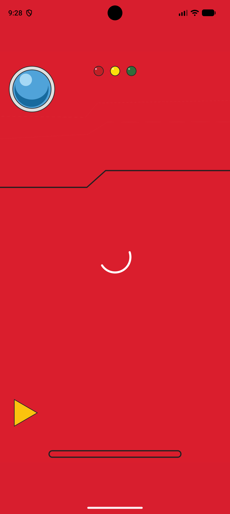
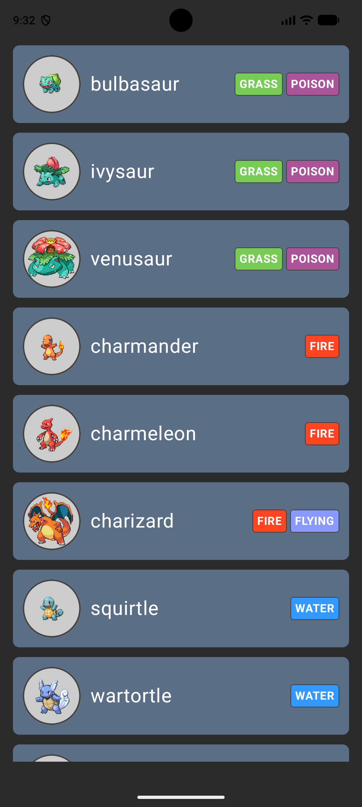
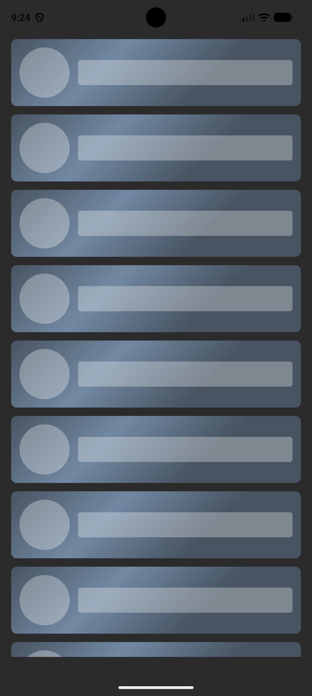
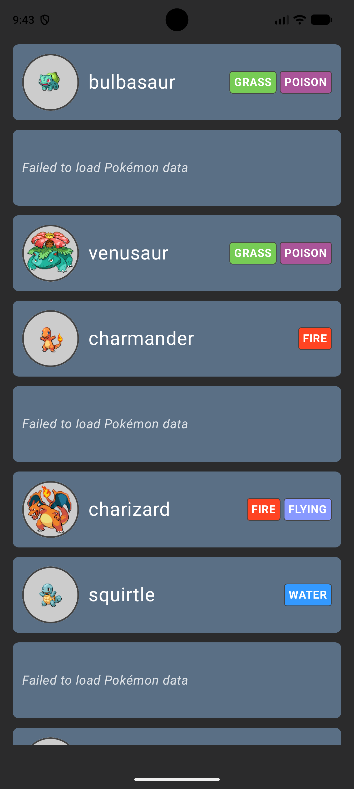

# Pokédex Demo App
A demo app for the Edward Jones interview process. Displays a list of Pokémon data.

## The Prompt
Build a small Android app that fetches a list of Pokémon from the free
PokéAPI ( https://pokeapi.co ) and displays them.

**The one hard requirement:** the app must retrieve data from the network
and show a list of Pokémon. Everything else: architecture, libraries,
language choices, scope, and polish, is up to you. Keep it simple.

**Endpoint to get you started:** GET https://pokeapi.co/api/v2/pokemon?limit=20&offset=0 

Each result includes a name and a url; hitting that url returns full detail
(sprites/images, types, stats, etc.). No API key required.

LLM tools are allowed. Use whatever you'd use in your normal workflow.

**Timebox:** aim for ~3-4 hours. Don't gold-plate. If you trade something off to
save time, feel free to note it.

**Deliverable:** push your project to a GitHub repository (public or private)
and share the link. If private, add the reviewers we specify as collaborators
so we can pull and run it. Include a short README covering how to run it,
the choices you made and why, and what you'd do next with more time.

## How to Run
To install the app you must open the project in Android Studio and build/deploy to an Android
device or emulator. Once it's installed, you can open and run it!

## What I Did
The app displays a list of all Pokémon from the PokéAPI. It progresses from a splash screen to the 
Pokémon list screen, or an error screen if the initial call fails. This is done using a
sealed `DataState` class.

Pokémon are asynchronously loaded in batches of 20. When the user scrolls to the bottom of the list,
the next batch is added to the list as `Loading` states so the user can see when more data is being 
loaded. Once the data comes back from the service, we update the loading states with the actual data
(or an error).

| Splash Screen                                                             | Error Screen                                                            | List Screen                                                           |
|---------------------------------------------------------------------------|-------------------------------------------------------------------------|-----------------------------------------------------------------------|
|  |  |  |


| Loading Pokémon                                                               | Partially Loaded Pokémon                                                                        |
|-------------------------------------------------------------------------------|-------------------------------------------------------------------------------------------------|
|  |  |

### Project Structure
```
pokedex-demo        // root project directory
    ↳ app           // main Android application files - hosts MainActivity and wires up Hilt and feature modules
    ↳ core
        ↳ data      // responsible for repository logic - managing pagination, data fetching, and coordinating api calls
        ↳ model     // shared domain, dto, and utility data classes
        ↳ network   // responsible for service logic - http network requests, Moshi and Retrofit setup
    ↳ docs          // non-code files for documentation purposes
    ↳ feature
        ↳ pokemon   // feature module containing view models and composables for displaying a list of Pokémon
    ↳ gradle        // gradle build configuration directory
```

### Architectural Decisions
- Minimum SDK will be API 34, due to the Google Play Store requirement found here: 
https://developer.android.com/google/play/requirements/target-sdk
    - > "New apps and app updates must target Android 16 (API level 36) or higher to be submitted to
      > Google Play; except for Wear OS and Android Automotive OS apps, which must target Android 15
      > (API level 35) or higher, and Android TV and Android XR apps, which must target Android 14
      > (API level 34) or higher."
    - I intend to expand upon this demo app for my personal use, so I would like to target as many
      device types as I can.
- Using a modularized app structure to mimic a real-world application.
- Data flows from `PokeApiService` -> `PokemonRepository` -> `PokemonListViewModel` ->
`PokemonListScreen`
- Using dependencies Hilt, Moshi, Retrofit, and Coil.
  - Though not _strictly_ necessary, these are the libraries I'm familiar with, they provide much
  needed functionality, and they are lightweight enough for a small project like this.
- Using Jetpack Compose for all UI components
- The logic around fetching data will be robust and encapsulate loading, error, and success states.
- The app will open to a splash screen before fetching data. All loading, error, and success states
will be represented in the UI.

### Cuts for Time
Even though I ended up taking more than 3-4 hours to make what I _thought_ was a simple app (I'm 
looking at you, modularization), I still had to make a lot of cuts that I usually wouldn't 
compromise on.

- An assumption is made that when we make the API call to `/pokemon`, we will always get as many
results as we requested (i.e. if `limit=20` we will get 20 results). Normally I wouldn't assume that
any response from an API is what we expect it to be, but this assumption cuts down on a lot of 
logic.
- View model methods are a little clunky right now and don't fully handle error states. Ideally I'd
break them apart for readability and move the bulk of the logic into another business layer so that
the view model can stay clean and simple.
- Unit tests for `PokemonRepository` and `PokemonListViewModel`
- UI tests for composables
- Style definition with consistent colors, text styles, padding values, etc.
- Outlined text within the type chips since some of them are hard to read
- Dedicated Talkback support, i.e. `mergeDescendants`
- Extracting resources from composables and saving more values in constants
- Importing the splash screen image into the project rather than fetching it from the internet
- Retry functionality if there's an error
- Converting raw Pokémon names to title case
- Displaying some sort of loading indicator at the bottom of the page when waiting for the initial 
Pokémon list data
- Error logging
- Building a prod `.apk` for easy installation
